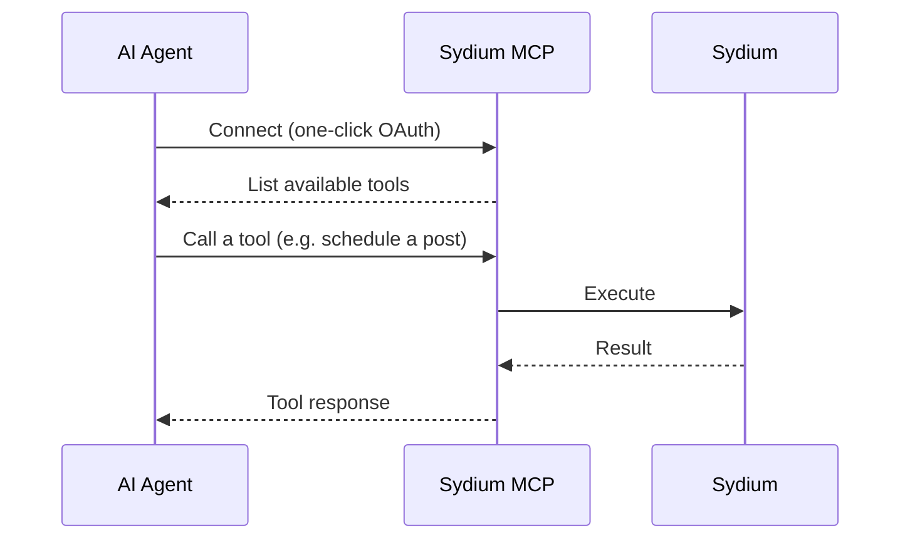

The Model Context Protocol (MCP) lets AI agents talk to Sydium directly - list your accounts, draft captions in your brand voice, publish, schedule, cancel, and pull analytics - all through natural language.

Point any MCP-compatible client (Claude, ChatGPT, Cursor) at the Sydium MCP server and run your social media by just asking.

**Endpoint**

```
https://api.sydium.com/v1/mcp
```

## How it works

Sydium exposes an MCP server that provides **7 tools**. Your agent connects once, discovers the tools and their schemas, and calls them on your behalf.



## Available tools

| Tool | Scope | What it does |
| --- | --- | --- |
| `list_accounts` | `accounts:read` | List your connected social accounts |
| `get_platform_capabilities` | `capabilities:read` | Per-platform posting limits, formats, and post types |
| `generate_caption` | `generate:write` | Draft a caption in your brand voice |
| `publish_post` | `posts:write` | Publish now or schedule to one or more platforms |
| `get_post_status` | `posts:read` | Per-target status of a publish or schedule operation |
| `cancel_post` | `posts:write` | Cancel a still-scheduled operation |
| `get_analytics` | `analytics:read` | Account analytics time-series |

<Card title="Tools reference" icon="wrench" href="/mcp/tools">
  Full input schema and behavior for every tool.
</Card>

## Authentication

Connecting is **one click, no API keys to paste.** Sydium's MCP server is a full OAuth 2.1 resource server with **dynamic client registration** - your MCP client registers itself automatically, then sends you to a Sydium consent screen where you click **Authorize**. You never copy a token, and nothing happens outside the scopes you approve.

<Info>
  Unlike most tools, you do **not** need to register a developer app or generate an API key to use Sydium over MCP. Add the endpoint to your client and authorize in the browser.
</Info>

## Connect your client

<Card title="Client setup" icon="plug" href="/mcp/connect">
  Step-by-step for Claude Desktop, ChatGPT, and Cursor.
</Card>

## Quick example

Once connected, just talk to your agent:

```
Publish my launch post to all my accounts in my voice,
then schedule the recap thread for Friday at 9am.
```

The agent calls `list_accounts`, `generate_caption`, and `publish_post` (with `scheduleAt`), then reports back. You keep the final say.

## FAQ

<AccordionGroup>
  <Accordion title="Do I need an API key?">
    No. MCP uses one-click browser OAuth with dynamic client registration. API keys are only for the REST API and CLI.
  </Accordion>
  <Accordion title="Which clients are supported?">
    Any MCP-compatible client - Claude (desktop and web), ChatGPT, Cursor, and others. See [Client setup](/mcp/connect).
  </Accordion>
  <Accordion title="Can the agent post videos and images?">
    The agent works with text and captions out of the box. Attaching media through the agent is limited today - media is uploaded and managed in the Sydium app, since agents cannot stream binary uploads. Broader agent-driven media support is planned.
  </Accordion>
  <Accordion title="What can it access?">
    Only the scopes you approve on the consent screen, and never more than your own team role allows.
  </Accordion>
</AccordionGroup>
